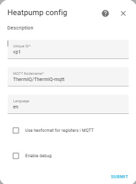
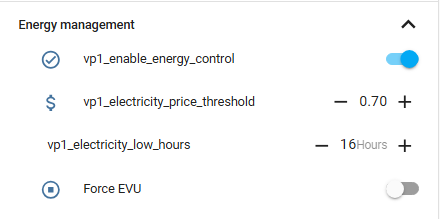

# Home Assistant ThermIQ Integration
[](https://github.com/custom-components/hacs)


This integration allows you to use the **ThermIQ-MQTT** and **ThermIQ-Room2** hardware interface to control and monitor your Thermia or Danfoss heatpump from Home Assistant. It is actively supported both here and at [Thermiq.net](https://thermiq.net)

**Please support the continous development by buying a ThermiQ-room2 from ThermIQ, we are a small company and Your support makes a difference!**
Get the neccessary hardware from [Thermiq.net](https://thermiq.net), where you also can read more about our products and background. 

# Steps to install ThermIQ HA Integration
1. Install the Mosquitto Add-on in Home Assistant.
2. Install [MQTT Explorer](https://mqtt-explorer.com/) on your PC and verify that you can connect to Mosquitto
3. Configure your **ThermIQ** device according to the indstructions at [Thermiq.net](https://thermiq.net)
1. Use MQTT-Explorer to verify that your **ThermIQ** device is sending information to Mosquitto. You should see MQTT messages in MQTT-Explorer from the heatpump every 30s
2. Install the MQTT Integration in Home Assistant and verify that it's communicating with the Mosquitto Add-on.
3. Install [HACS](https://github.com/custom-components/hacs)
5. Click  [](https://my.home-assistant.io/redirect/hacs_repository/?owner=ThermIQ&repository=thermiq_mqtt-ha&category=integration) to install the ThermIQ-MQTT integration   
  or Go to the HACS integrations page, add ThermIQ integration.
6. Restart HA  
  
7. Go to Integrations and add ThermIQ.
   1. 
   1. The MQTT Nodename should be the same as you set during wifi-config in step 3, without a "/" at the end
   2. Use hexformat only if you have the old 1.xx ThermIQ-MQTT firmware 
   3. Use debug if you want to try it out without actually writing to the heatpump
8. To control and monitor the heatpump from your dashboard:
   1. HACS->Frontend->Explore/Add [HTML Jinja2 Template card](https://github.com/PiotrMachowski/Home-Assistant-Lovelace-HTML-Jinja2-Template-card)
   2. HACS->Frontend->Explore/Add [Number Box](https://github.com/htmltiger/numberbox-card)
   3. HACS->Frontend->Explore/Add [fold-entity-row](https://github.com/thomasloven/lovelace-fold-entity-row)
   4. Download/save the images [vp_base.png](vp_base.png), [vp_base_hgwon.png](vp_base_hgwon.png) and [vp_base_hw.png](vp_base_hw.png)
   5. Upload the downloaded files to your Home Assistant machine to either the folder **www/community/** or (**local/community/**)
   6. Go to your dashboard and add a new manual card
   7. Copy/paste the contents of [ThermIQ_Card.yaml](https://github.com/ThermIQ/thermiq_mqtt-ha/blob/master/ThermIQ_Card.yaml) into your manual card
   8. Before you save the card, adjust the ID if you've used anything else than the default **vp1** when setting up the integration. If you do: Ctrl+F with find/replace is your friend.
  
### Debugging

Use [MQTT Explorer](https://mqtt-explorer.com/) to ensure your heat pump is communicating with the **Moqsuitto** before setting up HA.

Home Assistant server sometimes needs to be restarted once all configuration is done

Make sure you use the right MQTT Nodename when configuring the HA Integration. The MQTT-Nodename is the same as the base **"Topic"** in MQTT-Explorer (without /data)

From v2.3.0 the pictures used has changed from *.jpg to *.png format to facilitate dark mode. You might want to update the dashboard-card

  
# ThermIQ Energy Control for **ThermIQ-Room2**
You can optimize energy usage directly from Home Assistance by using the excellent **AIO Energy Management** Plugin from [here](https://github.com/kotope/aio_energy_management)  


Steps to install:
1. Click **AIO Energy Management** [](https://my.home-assistant.io/redirect/hacs_repository/?owner=kotope&repository=aio_energy_management&category=integration) and install it
2. Follow the instructions on how to configure [**AIO Energy Management** together with either Nordpool or Entso-e](https://github.com/kotope/aio_energy_management)
3. In HA->Settings->Devices&Services-> Helpers, Create two new number helpers 

   - **vp1_electricity_price_threshold** with a reasonable price range and step size of 0.01
   - **vp1_electricity_low_hours** with a a range from 0-23, Step size 1  
   
    Create two switch helpers  
   - **vp1_enable_energy_control**
   - **vp1_force_evu**
   
4. Add the following to your **configuration.yaml** file, use the correct nordpool/entso-e sensor for your setup. Make sure you match the mqtt topic to your setup
```
aio_energy_management:
    cheapest_hours:
    - nordpool_entity: sensor.nordpool_kwh_se3_sek_3_10_025
      unique_id: vp1_cheapest_hours
      name: VP1 Cheapest Hours
      first_hour: 0
      last_hour: 23
      starting_today: false
      number_of_hours: input_number.vp1_electricity_low_hours
      sequential: False
      failsafe_starting_hour: 21
    calendar:
      name: My Energy Management Calendar
      unique_id: my_energy_management_calendar
```

5. Add the following to you **automations.yaml** file
```
- alias: Update AIO Energy Management
  description: Update AIO cheapest hours based on current settings
  triggers:
  - trigger: state
    entity_id: input_number.vp1_electricity_low_hours
  action:
    service: aio_energy_management.clear_data
    data:
      unique_id: vp1_cheapest_hours
  id: bc899c680e3e4bc1a57f6f20f92678cc
- alias: Set EVU based on price
  description: Cheapest hours turn off EVU, (most expensive turns on))
  triggers:
  - trigger: time_pattern
    hours: '*'
    seconds: '10'
  - trigger: state
    entity_id: input_number.vp1_electricity_price_threshold
  - trigger: state
    entity_id: input_boolean.vp1_enable_energy_control
  - trigger: state
    entity_id: input_boolean.vp1_force_evu
  - trigger: state
    entity_id: binary_sensor.vp1_cheapest_hours
  - trigger: state
    entity_id:
    - binary_sensor.vp1_cheapest_hours
      attribute: updated_at
  - trigger: homeassistant
    event: start
  action:
  - if:
    - condition: and
      conditions:
      - condition: state
        entity_id: input_boolean.vp1_force_evu
        state: 'off'
      - condition: or
        conditions:
        - condition: state
          entity_id: binary_sensor.vp1_cheapest_hours
          state: 'on'
        - condition: state
          entity_id: input_boolean.vp1_enable_energy_control
          state: 'off'
        - condition: numeric_state
          entity_id: sensor.nordpool_kwh_se3_sek_3_10_025
          below: input_number.vp1_electricity_price_threshold
    then:
    - service: mqtt.publish
      data_template:
        topic: ThermIQ/ThermIQ-mqtt/set
        payload: '{"EVU":0}'
    else:
    - service: mqtt.publish
      data_template:
        topic: ThermIQ/ThermIQ-mqtt/set
        payload: '{"EVU":1}'
```

6. **Restart Home Assistant**
7. You will now be able to use the **Energy Management** Tab in the ThermIQ panel to enable energy control, set your low cost limit and select the number of hours you want to have enabled. The AIO and ThermIQ-Room2 will make sure the hours selected are the cheapest ones. Use MQTT-Explorer to ensure you get the expected behaviour.


# Misc
#### Automations
No setup of automations is needed. You can use the normal "input_number" services to change a value in the heatpump. For example:

```service: input_number.set_value
data: {"entity_id": "input_number.thermiq_mqtt_vp1_indoor_requested_t", "value":20}
```

#### Available data
The data available is listed in [REGISTERS.md](https://github.com/ThermIQ/thermiq_mqtt-ha/blob/master/REGISTERS.md)

#### Features and Limitations
- Currently provides all data from the heatpump in the form of sensors and binary sensors
- Allows control over the heatpump 
#### ThermIQ-USB Support
Tom R has created [a Node-RED flow](https://github.com/tomrosenback/thermiq-node-red-homeassistant-config) converting the previous version, ThermIQ-USB, to use the same MQTT messages making it compatible with this integration.

#### Domoticz Support
If you are looking for a Domoticz version, it's available from Jack: [Domoticz](https://github.com/jackfagner/ThermIQ-Domoticz)

# Contributing
Contributions are welcome! If you'd like to contribute, feel free to pick up anything on the current [GitHub issues](https://github.com/ThermIQ/thermiq_mqtt-ha/issues) list!
The naming, translation and grouping of registers can be improved, your input is appreciated. Most of it is in the [thermiq_regs.py](https://github.com/ThermIQ/thermiq_mqtt-ha/blob/master/custom_components/thermiq_mqtt/heatpump/thermiq_regs.py)  

All help improving the integration is appreciated!


